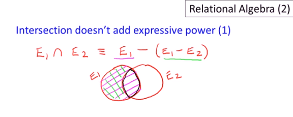

# Set Operators, Renaming, Notation

## Set Operators

### Union Operator

Standard set union. 

Again we have the College, Student, and Apply tables. What if we wanted a list of college and student names? 

So we already learned the CROSS PRODUCT (X) and NATURAL JOIN (BOWTIE). These operators combine info horizontally, matching them up. 

But we actually want our information vertically...

UNION OPERATOR (U)

PROJECT CName College UNION PROJECT SName Student

Technically two lists need to have the same schema to get union'd, so let's come back to this later. 

### Difference Operator

We want to find the IDs of students who didn't apply to any colleges.

PROJECT StudentID Student DIFFERENCE PROJECT StudentID Apply. 

DIFFERENCE OPERATOR (-)
is just a minus sign. 

What if we wanted IDs and names of students who didn't apply anywhere? A bit more work, huh?

PROJECT StudentName ((PROJECT StudentID Student DIFFERENCE PROJECT StudentID Apply) NATURAL JOIN Student)

It's a join back! We have that original difference operator used between the projection of Student Id from Student table and the projection of the Student Id from the Apply table, and then after that gave us the student IDs of students who did not apply anywhere, we joined it back (hence join back) on the Student table to grab all the information from a student ID, which includes their name. Now we can PROJECT student name from that and that gives us our desired result. 

### Intersection Operator

We want names that are both a college name and a student name. 

PROJECT cName College INTERSECTION PROJECT sName Student

INTERSECTION OPERATOR (upside down U, like a bridge)

Intersection operator like the union operator, actually needs the two tables to have the same schema. 

Hey, so intersection operator doesn't actually add expressive power. 

E1 INTERSECTION E2 is equal to E1 - (E1 - E2)

Visual example: 

E1 INTERSECTION E2 is equal to E1 NATURAL JOIN E2

Huh! 

## Quiz

Three of the following four expressions finds the names of all the students who did not apply to major in CS or EE. Which one finds something different?

Answer:

PROJECT sName Student - PROJECT sName(Student NATURAL JOIN (Project StudentID (SELECT major='CS' AND major = 'EE' Apply)))

This expression in its last part takes all student names from Student and subtracts all student names that were associated with IDs that applied to CS or EE. So now you have this big bundle of student names that excludes names of folk who applied but if there were folk who didn't apply who had the same name they have also been excluded. 

PROJECT cName College - PROJECT cName (Apply NATURAL JOIN (PROJECT sID (SELECT GPA > 3.5 Student) INTERSECTION PROJECT sID ( SELECT major = 'CS' Apply)))

College names excluding  
Student IDs whose GPA was more than 3.5 and Student IDs who majored in CS

"All colleges with no GPA>3.5 applicants who applied for a CS major at any college "

Nice! Got 'em right on the first try. 
